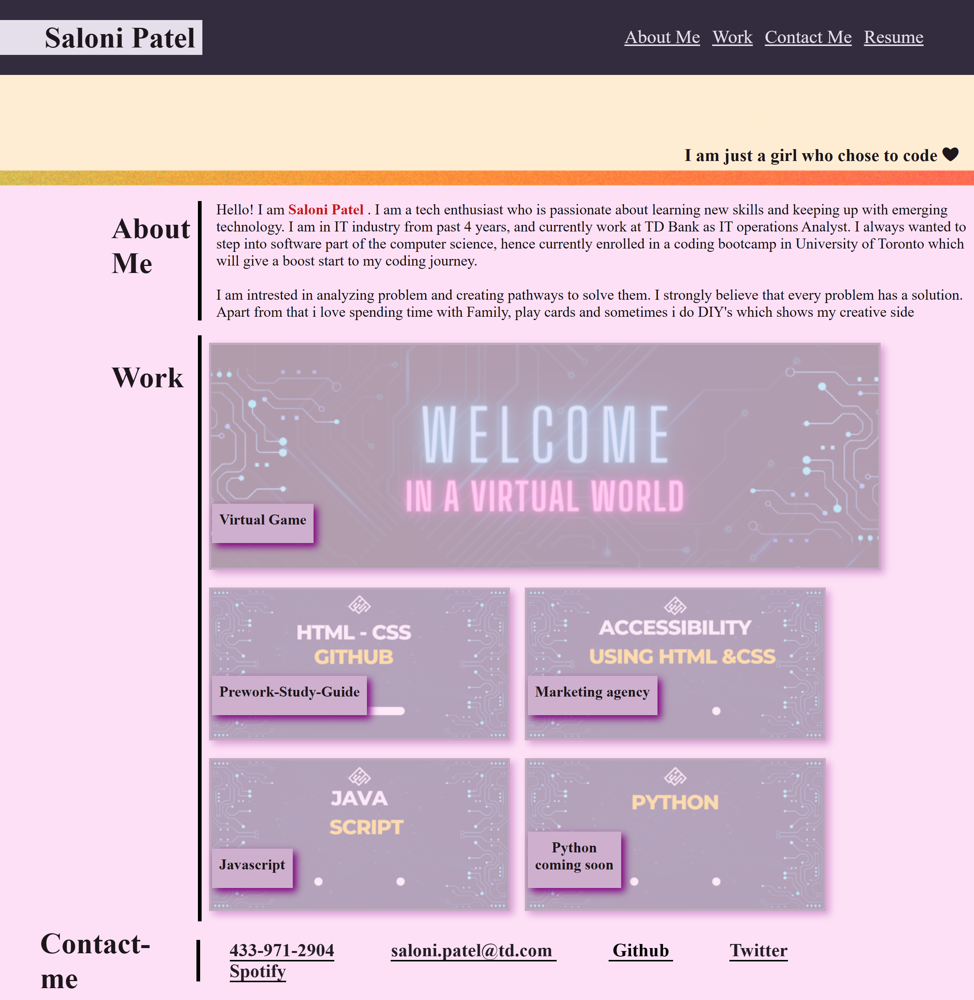

# My-Portfolio

## Description

This project was created to portrait my portfolio through which i can showcase my skills to my future employer. I created this project is living and offer a changing environment so i can edit it accordingly. This makes it easier for me to get all my projects on one page. Through this project i got to learn and impliment new skills like media query and flexbox and some other advanced CSS property.

## Installation

N/A

## Usage

This is a website portraying my skills, accomplishments and projects. It highlights some of my best work along with achievement and life values. This will showcase my work to future potential employer all in one page with my most promising projects. One can hover over one of my projects and it will show the image and title of my project. To further see the project, they can click the image and it will take them to the designated app for that project. My resume is also attached in the project in header and it can be downloaded form there. In footer i have mention my email, phone number and my github page so one can navigate and check my works there too. Screenshot of the image is added below.

## Credits

https://www.rapidtables.com/web/html/html-codes/html-code-heart.html - I used this page to get the symbol for the website

https://www.w3schools.com/css/default.asp - used to get some overview about few CSS properties

https://youtu.be/phWxA89Dy94 - used to clear some air in flexbox concepts

Jaytee Padilla - My tutor who helped me with concept of advanced CSS properties

## License

MIT license

## Link

link to the deployed application - https://saloni0412.github.io/My-Portfolio/